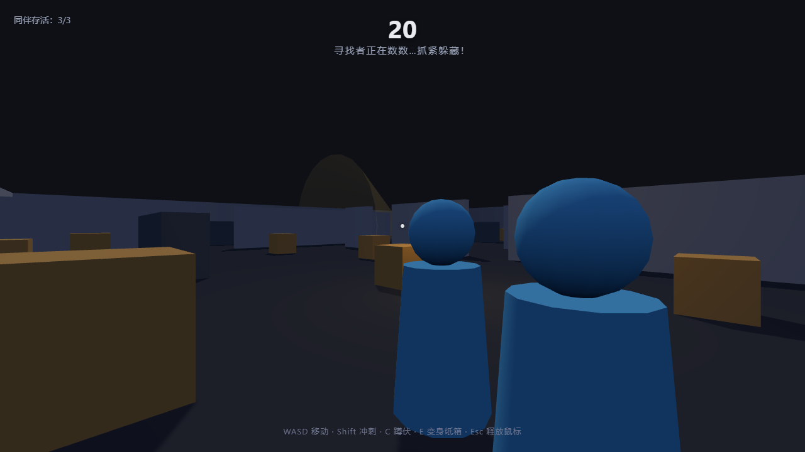

# 纸箱大逃亡 — 3D 捉迷藏 Demo



第一人称 3D 捉迷藏 demo：你是躲藏者，躲开 AI 寻找者的视线锥，活过 120 秒。
轻量技术栈：**Three.js + 原生 WebGL，零构建**，无外部美术/音频资源（场景程序化生成、音效 WebAudio 合成）。

## 启动

需要一个静态文件服务器（ES Modules 不支持 file:// 直开）：

```bash
cd hide-and-seek-3d
python -m http.server 8000   # 或 npm start
# 浏览器打开 http://localhost:8000
```

**Three.js 默认从 jsdelivr CDN 加载**（importmap 在 `index.html` 里）。这样做是因为
本机部分杀毒软件（如火绒）会扫描并拦截本地 HTTP 的 script 流量，导致本地
`three.module.js` 无法作为 ES Module 加载（fetch 正常但 import 被重置）。
仓库里的 `lib/three.module.js` 留作备用：在纯净环境或离线内网中，把 importmap
改为 `"three": "./lib/three.module.js"` 即可完全离线运行。

## 玩法

- 开局 **20 秒**躲藏时间，红色寻找者在角落"数数"；之后它出动巡逻，**活过 120 秒**即胜利。
- 黄色视线锥 = 它的视野，被照到并确认后它会变红追捕你；被追上即失败。
- 3 个蓝色 AI 同伴也会躲藏，它们被抓会替你分担注意力（倒地变灰即淘汰）。

## 操作

| 按键 | 动作 | 说明 |
|------|------|------|
| WASD | 移动 | |
| 鼠标 | 视角 | 点击"开始游戏"后锁定指针，Esc 释放 |
| Shift | 冲刺 | 快，但会发出噪音把寻找者引过来 |
| C | 蹲伏 | 慢，被发现距离从 18m 缩到 9m |
| E | 变身纸箱 | 原地伪装（视锥免疫）；移动露馅；3m 内会被识破；追逐中 6m 内变身无效 |

## 调试参数

| URL 参数 | 作用 |
|----------|------|
| `?flycam` | 俯瞰全图（验证地图布局） |
| `?play` | 跳过菜单自动开局（无指针锁定） |
| `?fast` | 躲藏 3 秒 / 存活 8 秒（配合 `?play` 做快速验证） |

控制台可通过 `window.__game` 访问游戏状态（state、seeker、player、hiders、timer）。

## 自动化测试

端到端测试驱动本机 Chrome，验证 AI 状态机与胜负判定（需要静态服务器已启动）：

```bash
npm install          # 安装 puppeteer-core
npm test             # = node test/e2e.mjs
```

覆盖断言：同伴散开、寻找者激活巡逻、巡逻移动、视野发现→警觉/追捕、抓捕→失败、倒计时→胜利。

## 技术要点

- **AI 状态机**：数数 → 巡逻（路径点）→ 警觉（0.6s 确认）→ 追捕（BFS 周期重寻路）→ 查看（最后目击点/噪音点扫视）。
- **视线检测**：距离 + 70° 视锥 + Raycaster 遮挡（墙体/货架/纸箱均可挡视线）。
- **寻路**：40×40 栅格 + BFS，路径共线点平滑。
- **碰撞**：圆形玩家 vs AABB 障碍物，逐轴解算；无物理引擎。

## 文件结构

```
index.html          importmap + UI 覆盖层
lib/three.module.js Three.js 本地备用（默认走 CDN，见上文）
src/main.js         入口、游戏状态机、主循环
src/world.js        程序化地图、灯光、关键点位
src/player.js       第一人称控制、蹲伏/冲刺/变身
src/seeker.js       AI 寻找者状态机 + 视线锥
src/hiders.js       AI 躲藏者同伴
src/pathfind.js     栅格化 + BFS 寻路
src/audio.js        WebAudio 合成音效
src/ui.js           HUD / 菜单 / 结算
test/e2e.mjs        puppeteer-core 端到端测试
```
